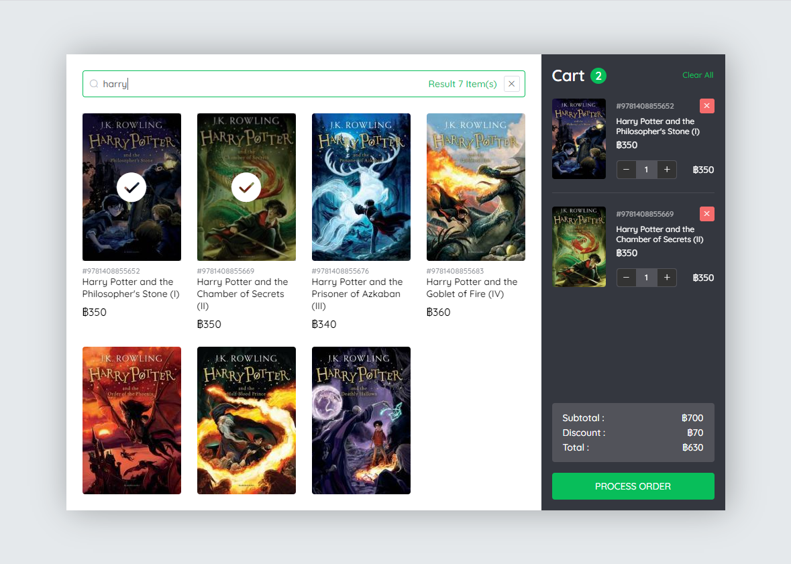

# POS
A simple POS application for a book shop.




## Online Demo

Support minimum screen width 1050px

[Cashier Screen](https://line-pos-ad514.web.app/)

[Customer Screen](https://line-pos-ad514.web.app/customer)


## Built With
* [vue](https://vuejs.org/) - JavaScript Framework
* [element-ui](https://element.eleme.io/#/en-US) - UI Toolkit
* [bootstrap](https://getbootstrap.com/) - CSS class utilities
* [numeraljs](http://numeraljs.com/) - Formatting numbers
* [firebase](https://firebase.google.com/) - Railtime databases

## Project setup
```
yarn install
```

#### Compiles and hot-reloads for development
```
yarn serve
```

#### Compiles and minifies for production
```
yarn build
```

#### Run your unit tests
```
yarn test:unit
```

#### Lints and fixes files
```
yarn lint
```
## License

The contents of this repository are covered under the [MIT License](LICENSE.txt).
